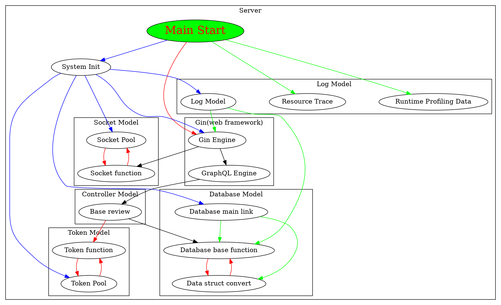
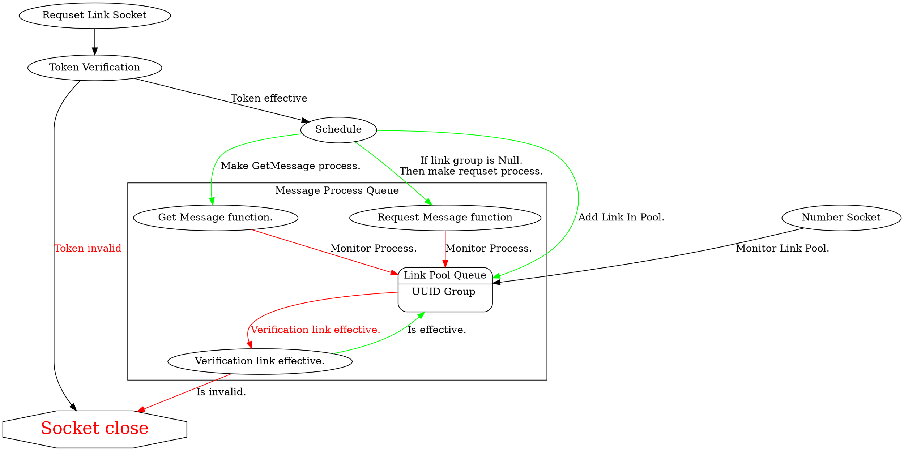
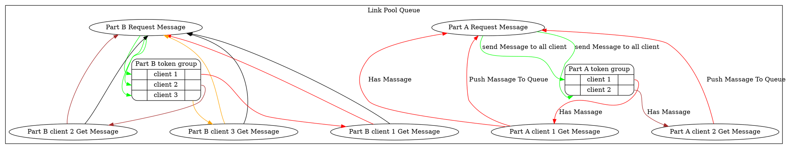
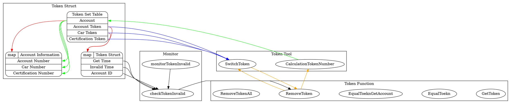

# NTUT_Special_Topic_2018_Server

Test url  : https://testapi.dennysora.com:8081
Test Data : https://hackmd.io/y9bGnuw9Qy-L4l6q-yFmOA

## Introduction

This Back-End Server use technology the following:

- Language 
    - Golang
- Web Framework
    - Gin
    - GrpahQL
        - [gqlgen](https://github.com/99designs/gqlgen)
        - For details, Please see my previous introduction.
        - https://hackmd.io/YXl3rRGGRGCLp9uuD6kJXQ
- Database
    - MongoDB
        - [mgo](https://github.com/globalsign/mgo)
        - [MongoDB](https://www.mongodb.com/)
- Microservice
    - Websocket
- Golang
    - [Golang](https://golang.org/)

---

## Member
- PM：**里冠樺**
    - Phone：0975-173-786
    - Email: js07150715@gmail.com
    - LINE:js07150715
- 負責、技術：**李汶道**
    - Phone：0988-954-004
    - Email：dennysora.main@gmail.com

---

## Information

- **Data：[Link](https://docs.google.com/spreadsheets/d/1M9j7oy62Fs07Jb1v8tfRBY6pEuGoOqYFR7i1onzjrws/edit#gid=1794248628)**

- **GitLab：[Link](https://gitlab.com/denny0258/ntut_special_topic_2018_server.git)**

- **Github：[Link](https://github.com/dennySORA/ntut_special_topic_2018_server)**

- **HackMD:[Link](https://hackmd.io/MvpqwfW1R8CqHsyTdN3_Ig)**


---

## Overall Struct


## System Struct

### Main System Start Up Flow

```flow
Start=>start: Start Main
Server=>end: Start Server
end=>end: Stop Server

Command=>subroutine: Command
InitLog=>subroutine: Init Log
InitDB=>subroutine: Init Database
InitToken=>subroutine: Init Token 
cond=>condition: Success or Error
cond2=>condition: Success or Error
cond3=>condition: Success or Error

Start->Command
Command->InitLog->cond

cond(no)->end
cond(yes)->InitDB->cond2

cond2(no)->end
cond2(yes)->InitToken->cond3

cond3(no)->end
cond3(yes)->Server

```

:::success

#### Main
- Defer recover.

#### Command
- Initialization component.
- Stop signal.
- Get error.

#### Init Log
- Create log file.
- Registered log function.

#### Init Database
- Create database link.
- Get **CarID** token.

#### Init Token
- Registered token function.
- Start monitor token invalid.

:::

---

### Server And Microservice Start Up Flow

```flow
server=>start: Start Server
end=>end: Monitor stop interrupt signal

ge=>subroutine: GraphQL Engine
se=>subroutine: Socket Engine
gin=>operation: Gin Default Init
rg=>operation: Gin Server registered
mw=>operation: Middleware registered

server->gin->mw->rg->ge->se->end

```

:::success

#### Gin 
- Make deault gin.
- Registered CORS.
- Registered log.
- Registered pprof.

:::

---

### Sokcet Microservice System Flow

```flow
server=>start: Sokcet Engine Start
end=>end: Monitor Message

LS=>operation: Link Socket
NS=>operation: Number Socket
Sc=>operation: Schedule
GM=>subroutine: Get Message
RM=>subroutine: Request Message

server->LS->Sc->GM->RM->end
```

:::success
#### LinkSocket
- Verification link authority .
- Distribution link ID.

#### NumberSocket
- Monitor Pool.
- Get link token from pool.
- Get link count from pool.

#### Schedule
- Check socket token has group.
- Make socket monitor process.

#### GetMessage
- Monitor socket pass in message.
- Transfer message to channel.

#### RequestMessage
- Monitor channel message.
- Transfer message to token group of every socket link.

:::

---

### GraphQL Microservice System Flow

```flow
server=>start: GraphQL Engine Start
end=>end: Request

MR=>subroutine: Monitor request
GP=>subroutine: GraphQL playground
resolver1=>subroutine: Resolver Mutation
resolver2=>subroutine: Resolver Query

Controller=>subroutine: Controller Model
DB=>subroutine: Database Model


server->MR->GP->resolver1->resolver2->Controller->DB->end

```

:::success
#### GraphQL playground
- 99designs-gqlgen-GraphQL provide.
- Can test GraphQL API.

#### Monitor request
- 99designs-gqlgen provide.
- Registered function.

#### Resolver Mutation
- Has the following function.
    - UpdateUser.
    - CreateAccount.
    - ChangePassword.
    - AddCarID.

#### Resolver Query
- Has the following function.
    - GetUser.
    - LogIn.
    - LogOut.
    - CheckAccountHas.
    - GetCarID.
    - GetTemporarilyToken.

#### Controller Model
- Review input information legality.
- Review token.
- Review account.
- Token convert account ID.

#### Database Model
- Query data to MongoDB.
- Insart data to MongoDB.
- Update data to MongoDB.

:::

---

## API Struct List 

### Account
#### CreateAccount
:::info
- Input parameter
    - AccountIDPW
        - AccountID
        - Password
    - User
        - Name
        - Gender
        - CountryNumber
        - PhoneNumber
- Output parameter
    - Status
        - StatusCode
        - Description
    - AccountID
:::

#### LogIn
:::info
- Input parameter
    - AccountID
    - Password
    - Information
        - Type
        - Device
- Output parameter
    - Status
        - StatusCode
        - Description
    - GetTimes
    - AccountID
    - AccountToken
:::
#### LogOut
:::info
- Input parameter
    - Token
    - Information
        - Type
        - Device
- Output parameter
    - Status
        - StatusCode
        - Description
:::
#### ChangePassword
:::info
- Input parameter
    - Token
    - OldPW
    - NewPW
- Output parameter
    - Status
        - StatusCode
        - Description
    - AccountID
:::
#### CheckAccountHas
:::info
- Input parameter
    - AccountID
- Output parameter
    - Status
        - StatusCode
        - Description
    - Has
:::
---

### Car
#### GetCarID
:::info
- Input parameter
    - Token
- Output parameter
    - Status
        - StatusCode
        - Description
    - CarID
    - CarName
    - CreateTime
    - RefreshTime
:::
#### GetTemporarilyToken
:::info
- Input parameter
    - Token
- Output parameter
    - Status
        - StatusCode
        - Description
    - Token
    - GetTimes
:::
#### AddCarID
:::info
- Input parameter
    - AccountID
    - CarName
    - TemporarilyToken
- Output parameter
    - Status
        - StatusCode
        - Description
    - AccountID
    - CarToken
:::
---

### User
#### UpdateUser
:::info
- Input parameter
    - Token
    - User
        - Name
        - Gender
        - CountryNumber
        - PhoneNumbe
- Output parameter
    - Status
        - StatusCode
        - Description
    - AccountID
:::
#### GetUser
:::info
- Input parameter
    - Token
    - GetHistorysNumber
- Output parameter
    - Status
        - StatusCode
        - Description
    - Car
        - Status
            - StatusCode
            - Description
        - CarID
        - CarName
        - RefreshTime
        - CreateTime
    - Profile
        - Name
        - Gender
        - Phone
            - PhoneNumber
            - CountryNumber
    - Accesse
        - Certification
        - PermitTime
        - Level
        - Permit_log
            - Level
            - Times
            - Authority
        - SiginHistory
            - Times
            - UseToken
            - Types
            - Device
        - LogoutHistory
            - Times
            - UseToken
            - Types
            - Device
:::

---

## Detail

### WebSocket design concept





---

### MongoDB design concept
```graphviz
digraph dfd2{
    nodesep=1.0

}
```

---


### Token design concept



---

## Appendix

### Error and Success Code

#### Error Code

:::danger

1. StatusCode:  -1
    - Description: Required fields can not be blank.

2. StatusCode:  -2
    - Description: Account exists.

3. StatusCode:  -3
    - Description: Account need Email.

4. StatusCode:  -4
    - Description: Login failed.

5. StatusCode:  -5
    - Description: Not found Account.

6. StatusCode:  -6
    - Description: Token Invalid.

7. StatusCode:  -7
    - Description: Add failure.

8. StatusCode:  -8
    - Description: Token remove error.

9. StatusCode:  -9
    - Description: Token Limit.

10. StatusCode:  -10
    - Description: Strong Password Not Good.

11. StatusCode:  -11
    - Description: Password is error.

12. StatusCode:  -12
    - Description: Password is same.

13. StatusCode:  0
    - Description: Internal error
:::

---

#### Success Code

:::success

1. StatusCode:
	- Description: Success Create Account.

2. StatusCode:
	- Description: Success LogIn.

3. StatusCode:
	- Description: Success Get Temporarily Token.

4. StatusCode:
	- Description: Success Add Car ID to User.

5. StatusCode:
	- Description: Success Get User Data.

6. StatusCode:
	- Description: Success Return AccountHas.

7. StatusCode:
   - Description: Success Get Car ID.

8. StatusCode:
   - Description: Success Update User.

9. StatusCode:
   - Description: Success Log Out.

:::

---

### Server Status

:::info

|         CPU        |  CPU平台  | Main Memory |   OS   |
|:------------------:|:--------:|:-----------:|:-------:|
|g1-small vCPU 1 core| Skylake  |    1.7GB    | CentOS 7|

:::

---


---


---


---

### Specification

https://docs.google.com/spreadsheets/d/1M9j7oy62Fs07Jb1v8tfRBY6pEuGoOqYFR7i1onzjrws/edit#gid=0


### GitLab

https://gitlab.com/denny0258/ntut_special_topic_2018_server.git